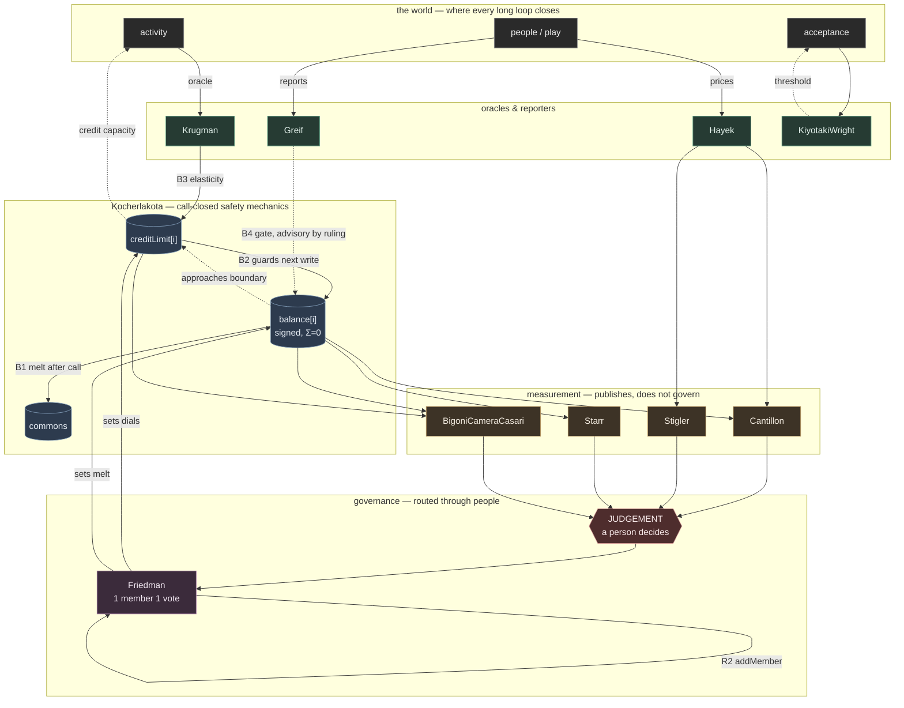

# The cast as a system — stocks, flows, and where the loops close

A stock-and-flow reading of all sixteen contracts, derived from the code rather than the intentions. Symbols: [`NOTATION.md`](NOTATION.md). The ground-up successor and its closure ledger are specified in [`V2-OVERHAUL-PLAN.md`](V2-OVERHAUL-PLAN.md).

**Correction first, because it changes the diagram:** the earlier audit called two `Kocherlakota` paths “closed automatic feedback loops.” That was too strong. Demurrage is decay triggered by `pay` or `poke`; the credit limit is a safety guard that reverts a transaction without restoring a stock. The closed on-chain objects are narrower **within-transaction invariants**—paired-write conservation and authenticated/authorised state changes—not complete institutional loops. Every claim about liveness, world observation, acceptance, consequence or continuation leaves the runtime and must return through a declared keeper topology. “Closed” is therefore qualified below rather than used as a synonym for “coded.”

---

## Stocks — the things that accumulate

| stock | owner | signed? | notes |
|---|---|---|---|
| `balance[i]` | `Kocherlakota` | **yes** | The core stock. Σ must be 0 ([`netSupply`](NOTATION.md#netsupply)). |
| `creditLimit[i]` | `Kocherlakota` | no | A stock of *permission*, not of value. It caps new exposure; it does not make an existing debtor perform. |
| pending demurrage | `Kocherlakota` | no | Accrued, uncharged. Invisible between touches. |
| `commons` balance | `Kocherlakota` | yes | Where the melt lands. A named beneficiary. |
| reputation | `Greif` | **yes** | Fed by reporters, read as a gate. |
| index level | `Hayek` | no | The rod. Median of competing providers. |
| observations | `BigoniCameraCasari` | no | Accumulating evidence, per arm. |
| registered sinks | `Starr` | no | Decreed and realised obligation streams. |

---

## Two automatic consequences after a call — not complete loops

These paths execute deterministically once a caller supplies a valid transaction. That is **call-closure**, not self-starting liveness, observation, response or economic continuation.

**B1 — the melt (a caller-triggered balancing tendency on the store function).**
```
balance[i] > 0  →  _accrue on touch  →  fee = balance · demurrageBps · elapsed / period
                →  balance[i] falls, commons rises  →  (loop)
```
Gesell's design supplies a balancing tendency: holding is taxed, so holding should fall. But `_accrue` fires inside `pay`, so **transacting is what charges the idle**, and a balance nobody touches melts only when `poke` is called. The arithmetic consequence is call-closed. Its timing and incidence are not: somebody must pull, and caller order can decide who is charged before a rate change.

**B2 — the limit (an ex-ante safety boundary on debt).**
```
balance[i] falls  →  approaches −_limitOf(i)  →  require() blocks the next transfer  →  (loop)
```
This is the floor that the token form gets for free and the signed ledger has to legislate. A failed `require` leaves the state unchanged: it blocks additional exposure but supplies no return arrow that makes an existing debtor repay. [`BigoniCameraCasari`](BigoniCameraCasari.sol) can measure whether the boundary ever engages—if [`b`](NOTATION.md#b) reads zero, B2 never fired and no behaviour in that run is attributable to it—but the guard is not enforcement and not a feedback loop.

---

## Feedback claims that leave the system

Each of these is a proposed or partial feedback path, and each one routes through the world. Whether it closes depends on actors, observation, motivation, response, repair and continuation—not on the existence of the visible Solidity segment.

**R1 — acceptance (reinforcing).** The framework's central loop, and the one it is *about*.
```
marketability  →  acceptance  →  marketability
```
`KiyotakiWright` isolates the feedback and computes the threshold — but it takes marketability scores as **externally supplied**. The loop runs in the world; the contract is a demonstrator of its shape. Reinforcing in both directions: the cold-start trap and the collapse are the same loop with the sign flipped.

**B3 — the stabiliser (balancing, countercyclical by design).**
```
activity  →  Krugman.report (oracle)  →  stance()  →  elasticityFactorBps()
         →  Kocherlakota._limitOf  →  credit capacity  →  ⟨the real economy⟩  →  activity
```
Everything up to `_limitOf` is on-chain. The return arrow — does credit capacity change activity? — closes **outside**, and `activity` re-enters through an oracle. This is the longest loop in the building and the only one that touches production.

**B4 — the proposed performance-response path. Recorded, not enforced—and ruled that way.**
```
default  →  Greif.report by a reporter  →  reputation falls
        →  inGoodStanding() gate  →  reduced exposure  →  (loop)
```
`inGoodStanding` is a **view**, and nothing consumes it. The obvious repair is one line inside `Kocherlakota._limitOf`. It is refused, and the refusal is now written into both headers.

**Read the classes, not the arrows.** The judgement register sorts every decision into four kinds with different correct guards. The *input* to this loop — what counts as a default — is **adjudicative**, and its guard is arbitration with an appeals path. The *output* — credit limits per member — is **normative**, and its guard is the affected members, voting; the register calls it the most consequential distributional call in the system. An automatic wire supplies neither. It is not the wrong guard. It is the **absence** of one, in a path that `Greif.report`'s own comment describes as acting *"without evidence or appeal."*

**And the sign flips depending on who is reading.** Label it from the ledger's side and it is balancing: default → standing falls → exposure reduced → fewer defaults. Label it from the member's side and the same arrows are reinforcing: default → standing falls → limit falls → less room to trade out of the hole → default. One loop, balancing in the system's exposure and reinforcing in the member's capacity. Calling it "balancing" is not a reading of the arrows; it is a choice of vantage — and it is the aggregate vantage this framework exists to distrust. A reputation gate with no floor and no route back up is a debt trap with a clean interface.

So: **reputation is advisory, said plainly.** What would have to exist before the gate is wired — reports through `ChallengeBond` with a stated reason and a dispute window (the register already prescribes it), a floor the gate cannot cut below, and a way back up.

**R2 — composition (reinforcing, and the one to watch).**
```
Friedman members  →  propose/vote  →  addMember (onlySelf)  →  Friedman members
```
The DAO sets its own membership. That is a reinforcing loop on *who decides*, and it is the classic entrenchment risk.

**What is deliberately absent, and worth saying out loud:** there is **no arrow from `balance` to voting weight**. `Friedman` is one-member-one-vote — `isMember` is a boolean and `voted` is a boolean, with a quorum. So the plutocracy loop (*wealth → votes → dials → wealth*) **does not close in this system by construction**. That is the single most important negative space in the diagram, and it is a design choice, not an accident.

---

## The measurement tier — where the arrow actually went missing

The first draft of this page said the four meters have no return arrow at all. **That was wrong, and checking it is what found the real gap.** Every one of them already publishes:

| meter | publication path | what it must declare first |
|---|---|---|
| `Stigler` | `checkAndRecord` → `Checked` | — (the whole method is public) |
| `Cantillon` | `attribute` → `Attributed` | a stated counterfactual |
| `Starr` | `recordVerdict` → `Verdict` | a justified `gammaStar` threshold |
| `BigoniCameraCasari` | `finding` → `Finding` | a pre-declared minimum sample |

Four for four, all state-changing rather than views, and three of the four refuse to publish until a discipline has been declared. `Stigler.checkAndRecord` even exists *for this reason*, and says so: `check` is a view, so *"a contract built to X-ray the skim leaves no image when it finds one."* These are the most disciplined publication paths in the cast. They are not ornamental.

The break was at the **other end of the chain**:

```
meter  →  a finding  →  ⟨JUDGEMENT-REGISTER: a person decides⟩  →  Friedman proposal  →  dials
                                                                        ↑
                                                          nowhere to record what it answers
```

`Friedman.Proposal` was `{target, data, eta, yes, executed}`. A dial could move with no reason attached to it — so the chain ended in a call that could not be reconstructed later, and it ended **silently**, which is §0.2's failure precisely: the non-event left no trace. Fixed here: `propose` now takes a required `rationale`, stored and evented. It automates nothing — a human still writes the sentence and the members still vote. It makes the human's step leave a record, which is the same discipline the meters already keep, applied at the one point in the building that can act on the world.

**What is still open, stated as the gap it is.** The canon supplies *capabilities* and refers *duties*. A finding can now be published and a proposal can cite it, but no response topology, obligation or clock is declared. That need not be repaired by appointing one official: affected users may independently change future terms, a quorum may respond, or nobody may respond. The honest residue is the unnamed edge between finding and consequence, including the possibility of non-action.

The long path can return **through people and institutions, on purpose**. That remains the architecture's thesis, but the audit question is now sharper: for every arrow, name who observes, who pulls, why they pull, what they may do, and what happens when they do not.

## The thesis is true. Its comfort is misplaced.

The claim survives tracing — but tracing shows the people standing in these loops are not all the same kind of person, and the difference is the whole story.

**Two roles, routinely conflated—and only part of the topology.** A **decider** supplies a judgement: what the index reads, what counts as a default, where the credit limit lands. A **trigger** supplies a clock: someone has to *call* the function, because nothing here wakes up (§0.2). The wider circuit also needs observers, reporters, responders and repairers. Deciders are enumerated, classified and guarded by the register. The other functions are not yet systematically typed.

Sort the loops that way and the picture changes:

| loop | decider | trigger | guarded? |
|---|---|---|---|
| B1 melt | — | whoever calls `pay` or `poke` | **no** |
| B2 limit | governance, when it sets the dial | whoever calls `pay` | the dial is; the timing is not |
| B3 stabiliser | the oracle, then governance | whoever reports | partly |
| B4 reputation | a reporter | — (advisory) | ruled, not wired |
| R2 composition | the members | a member | yes |

**The two paths once called fully closed have no in-call decider.** That was read as their virtue. But B1 still has a trigger whose timing is distributional, while B2 is only a guard. Determinism after a call does not supply the rest of an institutional circuit.

**The demonstration, now a passing test.** `setDemurrage` is documented as a steward lever that, set to zero, erases *"every holder's pending liability."* Uniform, as written. It is not uniform: `_accrue` erases only the span nobody has charged yet, so the erasure reaches exactly the holders no one happened to poke first. `test_Gesell_WhoPaysTheMeltIsDecidedByWhoeverPokesFirst` puts two holders side by side with the same balance, the same elapsed time and the same rate, pokes one before the rate falls, and ends with one having paid and the other not. No rule distinguishes them. `netSupply()` reads zero at every step — which is the point, not a mitigation: the invariant the ledger actually guarantees never moves, and the entire redistribution happens in gross claims. *Extraction pools in the known-ness gap*, as an assertion rather than a slogan.

Governance sets the rate. **Caller order decides who it lands on.** The triggering function may be distributed across transactors, rewarded open callers, or an office; V1 declares none of those as a topology, so it cannot state the liveness or incidence assumption it is making.

**Why the register missed it.** Its four-class table sorts *decisions*—adjudicative, epistemic, normative, constitutive—and assigns each a guard. A trigger need make none of those decisions; it makes a **timing choice**, and the table had no row for timing. So an instrument built to enumerate judgements could not see one of the people affecting incidence. Executive action must therefore declare a keeper topology, clock, motivation, fallback and succession rather than merely add a fifth decision label.

**The asymmetry worth sitting with.** Since `propose` began requiring a stated reason, the governance half of that episode—the call setting the rate to zero—has to say on the record what it answers. The triggering half still says nothing. The same distributional episode is now half-legible, and the half that stayed dark is the half nobody voted for.

So: trace every edge and find its actors. Some appear only when the audit stops looking solely for judgement and asks who observes, pulls, responds and repairs.

## No skyhook: keeper functions and their topologies

Keepership was missing from the cast because the framework's own grammar had no slot for it. `FOUNDATIONS.md` defined a mode as *"a rule about when and whether the ledger must clear."* **Must—who observes, who triggers, who records, who responds, and who repairs?** A duty with none of those functions assigned is not stricter; it is unfinished. And an agentless *must* is precisely the essentialist grammar this project exists to refuse: money *has* value, the market *clears*, prices *adjust*—delete the actors and the property floats free, which is the whole trick.

The book's field card had always asked the question the definition dropped—*"when and whether must this clear, **and says who?**"* The practical tool was right and the theory was not. The further correction is that there need not be one answer. Authentication may be bilateral, triggering open, observation distributed among affected users, findings made by a peer quorum, and rule maintenance assigned to an office. Keeperhood attaches to an action, not once to the whole system.

`Ostrom` gives the **appointed-office topology** a storage slot. An office is a stated duty, a holder appointed with a mandate, and a clock; anyone may flag it overdue, converting one kind of silence into a reported event. That remains useful where the group actually appoints an office. It is not required for a tally rope, Bitcoin validation, bilateral correct change, customary refusal, or every other function users can distribute among themselves.

**What it does not do, stated plainly, because the temptation runs the other way.** It cannot call the target; `flagOverdue` needs a caller too. Its holder self-attests performance, so the record does not establish the world fact. It does not punish—that would fuse an epistemic/adjudicative input to a normative output with neither guard. And a reward such as `Kocherlakota.pokeRewardBps` addresses willingness only under a price assumption; it does not establish accountability, timing, succession or enough continuation surplus to keep the function supplied.

V2 therefore does not terminate the regress in one named party. It terminates each **specified edge** in a declared topology or an explicit open boundary. Distributed users can supply the consequence by changing their own future acceptance, credit, cooperation or forgiveness; an office, issuer or regulator is optional. The remaining empirical question is whether expected future opportunity is large and reliable enough to cover defection and keeper costs. That belongs in the continuation assumption and simulation, not in a Solidity address.

---

## The diagram



Solid arrows are on-chain calls. Dashed arrows leave the system and return through the world. Every dashed arrow needs an actor, evidence path, motivation and failure path—or must be labelled an explicitly open boundary.

---

## What the diagram makes visible

1. **Two call-deterministic paths, not two complete loops.** B1 is triggered decay; B2 is a guard. The defensible closed claims are transaction-safety invariants.
2. **The material reinforcing loops are social or cross-boundary**—acceptance (R1) in the world, composition (R2) among the DAO's members. Code can record or constrain pieces without manufacturing the return path.
3. **The measurement tier exits to a response topology**, and every meter already publishes under some discipline. What remains missing is who may consume the finding, why they respond, under which guard, on what clock, and with what repair or refusal path.
4. **`balance → votes` is missing on purpose.** Wealth does not buy dials here.
5. **B4 stays unwired, by ruling.** Reputation is advisory. Automating it would drive a normative output from an adjudicative input with neither class's guard in the path — and the loop's sign depends on whether you read it from the ledger's side or the member's.
