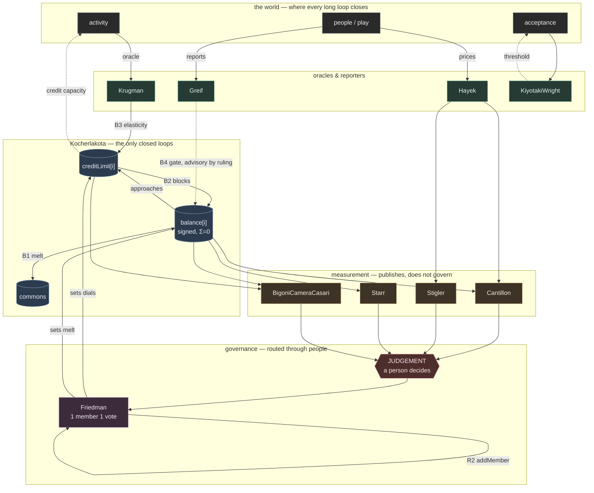

# The cast as a system — stocks, flows, and where the loops close

A stock-and-flow reading of all fifteen contracts, derived from the code rather than the intentions. Symbols: [`NOTATION.md`](NOTATION.md).

**The finding, first, because it is the whole diagram:** the contract system contains **exactly two closed automatic feedback loops**, and both live inside `Kocherlakota`. Every other loop leaves the system and returns through an oracle, a reporter, a provider, or a human governance call. That is not an omission. It is the architecture's signature — *"nothing in here can act on its own"* — and it is checkable, so it should be checked.

---

## Stocks — the things that accumulate

| stock | owner | signed? | notes |
|---|---|---|---|
| `balance[i]` | `Kocherlakota` | **yes** | The core stock. Σ must be 0 ([`netSupply`](NOTATION.md#netsupply)). |
| `creditLimit[i]` | `Kocherlakota` | no | A stock of *permission*, not of value. The teeth. |
| pending demurrage | `Kocherlakota` | no | Accrued, uncharged. Invisible between touches. |
| `commons` balance | `Kocherlakota` | yes | Where the melt lands. A named beneficiary. |
| reputation | `Greif` | **yes** | Fed by reporters, read as a gate. |
| index level | `Hayek` | no | The rod. Median of competing providers. |
| observations | `BigoniCameraCasari` | no | Accumulating evidence, per arm. |
| registered sinks | `Starr` | no | Decreed and realised obligation streams. |

---

## The two closed loops — fully on-chain

These need no caller beyond the transacting party. They are the only genuinely automatic dynamics in the building.

**B1 — the melt (balancing, on the store function).**
```
balance[i] > 0  →  _accrue on touch  →  fee = balance · demurrageBps · elapsed / period
                →  balance[i] falls, commons rises  →  (loop)
```
Gesell's design as a balancing loop: holding is taxed, so holding falls. Note the trigger — `_accrue` fires inside `pay`, so **transacting is what charges the idle**, and a balance nobody touches melts only when `poke` is called. The loop is closed but its *clock* is event-driven.

**B2 — the limit (balancing, on debt).**
```
balance[i] falls  →  approaches −_limitOf(i)  →  require() blocks the next transfer  →  (loop)
```
This is the floor that the token form gets for free and the signed ledger has to legislate. [`BigoniCameraCasari`](BigoniCameraCasari.sol) exists to measure whether this loop ever actually engages — if [`b`](NOTATION.md#b) reads zero, B2 never fired and no behaviour in that run is attributable to it.

---

## The loops that leave the system

Each of these is a genuine feedback loop, and each one routes through the world.

**R1 — acceptance (reinforcing).** The framework's central loop, and the one it is *about*.
```
marketability  →  acceptance  →  marketability
```
`KiyotakiWright` isolates the feedback and computes the threshold — but it takes marketability scores as **externally supplied**. The loop runs in the world; the contract is a demonstrator of its shape. Reinforcing in both directions: the cold-start trap and the collapse are the same loop with the sign flipped.

**B3 — the stabiliser (balancing, countercyclical by design).**
```
activity  →  Krugman.report (oracle)  →  stance()  →  elasticityFactorBps()
         →  Kocherlakota._limitOf  →  credit capacity  →  ⟨the real economy⟩  →  activity
```
Everything up to `_limitOf` is on-chain. The return arrow — does credit capacity change activity? — closes **outside**, and `activity` re-enters through an oracle. This is the longest loop in the building and the only one that touches production.

**B4 — enforcement. Supported, not run — and ruled that way.**
```
default  →  Greif.report by a reporter  →  reputation falls
        →  inGoodStanding() gate  →  reduced exposure  →  (loop)
```
`inGoodStanding` is a **view**, and nothing consumes it. The obvious repair is one line inside `Kocherlakota._limitOf`. It is refused, and the refusal is now written into both headers.

**Read the classes, not the arrows.** The judgement register sorts every decision into four kinds with different correct guards. The *input* to this loop — what counts as a default — is **adjudicative**, and its guard is arbitration with an appeals path. The *output* — credit limits per member — is **normative**, and its guard is the affected members, voting; the register calls it the most consequential distributional call in the system. An automatic wire supplies neither. It is not the wrong guard. It is the **absence** of one, in a path that `Greif.report`'s own comment describes as acting *"without evidence or appeal."*

**And the sign flips depending on who is reading.** Label it from the ledger's side and it is balancing: default → standing falls → exposure reduced → fewer defaults. Label it from the member's side and the same arrows are reinforcing: default → standing falls → limit falls → less room to trade out of the hole → default. One loop, balancing in the system's exposure and reinforcing in the member's capacity. Calling it "balancing" is not a reading of the arrows; it is a choice of vantage — and it is the aggregate vantage this framework exists to distrust. A reputation gate with no floor and no route back up is a debt trap with a clean interface.

So: **reputation is advisory, said plainly.** What would have to exist before the gate is wired — reports through `ChallengeBond` with a stated reason and a dispute window (the register already prescribes it), a floor the gate cannot cut below, and a way back up.

**R2 — composition (reinforcing, and the one to watch).**
```
Friedman members  →  propose/vote  →  addMember (onlySelf)  →  Friedman members
```
The DAO sets its own membership. That is a reinforcing loop on *who decides*, and it is the classic entrenchment risk.

**What is deliberately absent, and worth saying out loud:** there is **no arrow from `balance` to voting weight**. `Friedman` is one-member-one-vote — `isMember` is a boolean and `voted` is a boolean, with a quorum. So the plutocracy loop (*wealth → votes → dials → wealth*) **does not close in this system by construction**. That is the single most important negative space in the diagram, and it is a design choice, not an accident.

---

## The measurement tier — where the arrow actually went missing

The first draft of this page said the four meters have no return arrow at all. **That was wrong, and checking it is what found the real gap.** Every one of them already publishes:

| meter | publication path | what it must declare first |
|---|---|---|
| `Stigler` | `checkAndRecord` → `Checked` | — (the whole method is public) |
| `Cantillon` | `attribute` → `Attributed` | a stated counterfactual |
| `Starr` | `recordVerdict` → `Verdict` | a justified `gammaStar` threshold |
| `BigoniCameraCasari` | `finding` → `Finding` | a pre-declared minimum sample |

Four for four, all state-changing rather than views, and three of the four refuse to publish until a discipline has been declared. `Stigler.checkAndRecord` even exists *for this reason*, and says so: `check` is a view, so *"a contract built to X-ray the skim leaves no image when it finds one."* These are the most disciplined publication paths in the cast. They are not ornamental.

The break was at the **other end of the chain**:

```
meter  →  a finding  →  ⟨JUDGEMENT-REGISTER: a person decides⟩  →  Friedman proposal  →  dials
                                                                        ↑
                                                          nowhere to record what it answers
```

`Friedman.Proposal` was `{target, data, eta, yes, executed}`. A dial could move with no reason attached to it — so the chain ended in a call that could not be reconstructed later, and it ended **silently**, which is §0.2's failure precisely: the non-event left no trace. Fixed here: `propose` now takes a required `rationale`, stored and evented. It automates nothing — a human still writes the sentence and the members still vote. It makes the human's step leave a record, which is the same discipline the meters already keep, applied at the one point in the building that can act on the world.

**What is still open, stated as the gap it is.** The canon supplies *capabilities* and refers *duties*. A finding can now be published and a proposal can now cite it, but nothing obliges anyone to answer a finding, and nothing runs a clock on it. The register enumerates classes of judgement; it has no column for **whose duty, on what clock**. That is the honest residue, and it is the same shape as the keeper problem in §0.2 — an unnamed party whose non-action leaves no record.

The loop closes **through a human, on purpose**. That is the architecture's thesis, and the diagram was offered as its proof: trace every loop, find the person.

## The thesis is true. Its comfort is misplaced.

The claim survives tracing — but tracing shows the people standing in these loops are not all the same kind of person, and the difference is the whole story.

**Two roles, routinely conflated.** A **decider** supplies a judgement: what the index reads, what counts as a default, where the credit limit lands. A **trigger** supplies a clock: someone has to *call* the function, because nothing here wakes up (§0.2). Deciders are enumerated, classified and guarded by the register. Triggers are not in it at all.

Sort the loops that way and the picture changes:

| loop | decider | trigger | guarded? |
|---|---|---|---|
| B1 melt | — | whoever calls `pay` or `poke` | **no** |
| B2 limit | governance, when it sets the dial | whoever calls `pay` | the dial is; the timing is not |
| B3 stabiliser | the oracle, then governance | whoever reports | partly |
| B4 reputation | a reporter | — (advisory) | ruled, not wired |
| R2 composition | the members | a member | yes |

**The two fully closed on-chain loops have no decider at all.** B1 and B2 run without anyone's judgement — and that was read as their virtue. It is, right up until you notice that a loop with no decider still has a trigger, and that in B1 the trigger's timing is *distributional*.

**The demonstration, now a passing test.** `setDemurrage` is documented as a steward lever that, set to zero, erases *"every holder's pending liability."* Uniform, as written. It is not uniform: `_accrue` erases only the span nobody has charged yet, so the erasure reaches exactly the holders no one happened to poke first. `test_Gesell_WhoPaysTheMeltIsDecidedByWhoeverPokesFirst` puts two holders side by side with the same balance, the same elapsed time and the same rate, pokes one before the rate falls, and ends with one having paid and the other not. No rule distinguishes them. `netSupply()` reads zero at every step — which is the point, not a mitigation: the invariant the ledger actually guarantees never moves, and the entire redistribution happens in gross claims. *Extraction pools in the known-ness gap*, as an assertion rather than a slogan.

Governance sets the rate. **The keeper decides who it lands on**, and nobody appointed the keeper.

**Why the register missed it.** Its four-class table sorts *decisions* — adjudicative, epistemic, normative, constitutive — and assigns each a guard. The keeper makes no decision in any of the four. They make a **timing choice**, and the table has no row for timing. So the instrument built to enumerate the humans in this building cannot see one of them. That is not a gap beside the register; it is a gap *in* the register, and it is the same hole as residue item 5 seen from the other side — item 5 says *nobody is obliged to act*, this says *whoever does act picks when, and when is distributional*. One gap: **duty and its clock.**

**The asymmetry worth sitting with.** Since `propose` began requiring a stated reason, the governance half of that episode — the call setting the rate to zero — has to say on the record what it answers. The keeper half still says nothing. The same distributional episode is now half-legible, and the half that stayed dark is the half nobody voted for.

So: you can trace every loop and find a human. Some of them you find only by looking for who *isn't* in the register.

---

## The diagram



Solid arrows are on-chain calls. Dashed arrows leave the system and return through the world. Every dashed arrow is a place the architecture chose not to automate.

---

## What the diagram makes visible

1. **Two closed loops, both balancing, both in one contract.** There is no reinforcing loop anywhere on-chain. The system cannot run away on its own — it can only be *driven*.
2. **The reinforcing loops are all outside or social** — acceptance (R1) in the world, composition (R2) among the DAO's members. That is where the framework's own warnings live, and neither is code.
3. **The measurement tier's only exit is a person**, and every meter already publishes to it under a declared discipline. The missing half was the citation on the far side, now required. What remains missing is a *duty with a clock* — nobody is obliged to answer a finding.
4. **`balance → votes` is missing on purpose.** Wealth does not buy dials here.
5. **B4 stays unwired, by ruling.** Reputation is advisory. Automating it would drive a normative output from an adjudicative input with neither class's guard in the path — and the loop's sign depends on whether you read it from the ledger's side or the member's.
