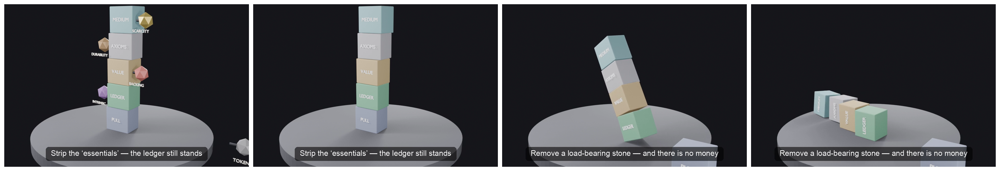

# Chapter 4: What Money Is

> *Money is a sufficiently-reliable ledger of who has given and not yet received. Most "properties of money" the textbook lists are special cases, bolt-ons, or category errors — and "scarce" is the biggest mistake of the lot.*

**Part II — Money as Coordination Infrastructure** · [Index](README.md) · Prev: [Chapter 3](03-consent-as-orthogonal.md) · Next: [Chapter 5](05-why-it-has-value.md)

## Opening scaffold

A young European tourist (unnamed) tries to pay €5 for coffee in Buenos Aires and is charged €16 — the official-rate fiction (≈3×) plus DCC, spread, and fee stacked on top; the arithmetic reconstructs. The mechanism is invisible to her; the friction is total. The number on her card was never the money — it was a claim, routed through ledgers she could not see.

## Structural beats

1. The €16 coffee.
2. How it happened — multiple exchange rates, card-processor games, hidden spreads. Several ledgers, each taking a cut, none of them shown to her.
3. The realisation: *the number on the card is not the money.* It is a claim on a record. So what is the record?
4. What money is, then. The thing that does the job is a **ledger** — a sufficiently-reliable account of *who has given and not yet received.* "Money is memory" (Kocherlakota); "money is credit" (Mitchell-Innes) — two names for one object, seen from two sides. And a sufficiently-divisible, sufficiently-known *good* **is** such a ledger: your holdings are your balance, a trade is an entry, the total is the conserved sum. The coin was the ledger in costume.
4b. The banks as the living proof: nearly all modern money is commercial-bank ledger entries, created in lending and destroyed in repayment (loans create deposits — Bank of England 2014); banking is ledgers clearing against ledgers across the central bank's master ledger (Mehrling's money view). The ledger thesis on its home turf — and elastic supply ("known, not fixed") at industrial scale.
5. What a substrate actually needs — **two families, not five loose properties.** *Resolution* (sufficiently divisible — fine enough for the trades you make). *Integrity* (no phantom value can enter — by conservation, by authentication, and by **symmetrically-known supply**). The rest — acceptance, availability, whether anyone settles — the *world* has to supply; Chapters 5 and 6 handle those.
6. The textbook list, reduced. "Scarce" is a crude, rigid way to get one slice of integrity — **known is the point, not fixed.** "Durable" is verifiability over time. "Stable in value" is the unit-of-account function bleeding in (Ch 7). "Backed," "intrinsic worth," the physical token — these do no work at all. Bolt-ons.
7. The cleaned-up picture: the load-bearing properties are exactly the *ledger* properties. Everything the goldbug points to as "real money" turns out not to be on the list.

## Themes

- Definitions decide everything downstream.
- Folk taxonomies of money confuse the record with the costume.
- Honest first principles produce shorter lists.
- The record is the money; the token is only the substrate it was kept on.

## Twists

- The reader expects a textbook chapter on the properties of money. Instead the chapter explains that the textbook list is mostly special cases of one thing — a reliable record.
- "Scarcity," long treated as the defining virtue of good money, gets demoted: what you need is *symmetrically known* supply, which a perfectly elastic money can have. Known, not fixed.
- The €16 was never money. It was the friction of several ledgers she could not inspect — the largest of them the state's official-rate fiction — which is the whole problem the rest of the book learns to see.

## Subarcs

- **The clearing-discipline identity is stated here** (seeded in Ch 2 via Fiske's counting observation): a mode is a rule about when and whether the ledger must clear; money is the Value discipline given infrastructure. Returns in Chs 6, 8A, 10, 12, 16, 19, 22, 22A and Epilogue A.9 — the joint between the modes half and the money half of the book.
- The ledger framing pays off in Intermezzo 8A, where the village's rope *is* the ledger made visible — and seeds the surveillance discussion in Chapter 16, where the record's "forgetfulness" turns out to be increasingly fictional.
- *Known ≠ fixed* returns in Chapter 18: inflation is what happens when symmetrically-known supply cracks.
- First appearance of the 3× credit-card story (returns Chs 11, 16). Here it is friction-as-diagnostic. The dual-rate mechanism seeds the cueva (Ch 13): the tourist pays the official fiction the locals go to the cave to escape.

## Closing scaffold

We know what money IS — a sufficiently-reliable ledger. We do not yet know why it has VALUE, and the answer will *not* be "because of what it is made of." The next chapter handles that, and it is the chapter most books get wrong.

---

## Draft

She orders a flat white. The little terminal turns toward her, she taps her card, it beeps, she leaves. Three weeks later, home in Europe, she is reading her statement and finds that the €5 coffee in Buenos Aires cost her €16.

Nobody robbed her, exactly. The €16 is the sediment of a chain of quiet decisions she never saw, and the largest of them was the state's. Argentina that year ran two exchange rates: an official one, held by decree at a fraction of what the peso actually traded for, and the street rate the whole city actually used. The café's menu was priced for people paying at the street rate — five euros' worth of pesos, at the rate that is real. Her card network, being a licensed and law-abiding thing, converted at the official one, and that single conversion nearly tripled the price before any bank had taken a bite. Then the bites: a "dynamic currency conversion" offered in a language she half-read and waved away, a spread on the conversion, a foreign-transaction fee for the privilege of the spread. By the time the coffee reached her statement it had passed through four or five ledgers, each of which took a little — and one of which, the state's, took the most while calling its rate the true one. None of them showed its working. (The room where the *real* rate lives, and why the city trusts it, we will visit a few chapters on.)

Hold onto what she has just discovered, because it is the door into this whole chapter: *the number on the card was never the money.* It was a claim — an instruction to move a balance — routed through records she could not inspect. The "money" she spent was not in her pocket or on the card. It was an entry in a ledger, and then another, and then another, and the friction she paid was the cost of those ledgers disagreeing.

Which forces the question the textbooks answer badly. If the money is not the number, and not the card, and not the coin — what *is* it?

The inherited answer begins with an object. Barter fails; a valuable commodity becomes money; paper represents the commodity; law and confidence take over when the commodity disappears. The costume changes, but the grammar does not: something behind the money pushes worth into it. Gold supplies substance, the state supplies authority, and "faith" fills whatever space remains.

That is a history of monetary costumes told as a theory of monetary value. We will open the value question in the next chapter. First we need to identify the machine all those costumes were carrying.

### The thing underneath

The shortest honest answer we know: **money is a sufficiently-reliable ledger of who has given and not yet received.** A record. When you hand over a coffee and receive nothing back yet, something has to remember that you are owed; when you hand over a coin, that coin *is* the something. Money is the memory of unfinished exchange, made reliable enough that strangers will act on it.

Two careful people arrived at this from opposite directions and met in the middle. Alfred Mitchell-Innes, a British diplomat writing in 1913, put it from the debt side: money and credit are the same thing seen from two angles; there is no coin that is not, underneath, a record of an obligation. Narayana Kocherlakota, eighty-five years later, put it from the information side and proved it — *money is memory*: anything that did the job of a perfect communal record would do the job of money, and the other way around. The village rope a few chapters from now is exactly this, made of fibre and laid in the open.

And here is the move that dissolves the old arguments: a sufficiently-divisible, sufficiently-known *good* does not merely *resemble* a ledger. It **is** one. How much you hold is your balance. A trade is an entry — your pile down, theirs up. The total in existence is the conserved sum of all the balances. The coin was never an alternative to the ledger; it was the ledger, written in the distribution of a metal instead of the rows of a book. There was no grand transition from "commodity money" to "abstract money." It was a ledger from the first divisible, countable good that changed hands. The substrate only ever got thinner — cattle, metal, coin, note, bank-entry, chain — each a better place to keep the same record.

### The banks were never hiding it

If the ledger claim still feels like a metaphor, look at where money actually lives now. In a modern economy the notes and coins are a rounding error — a few per cent of the total. The rest, the overwhelming bulk of what anyone means by *my money*, exists as entries in commercial banks' ledgers, and nowhere else. And those entries are not created by anyone printing anything. They are created by **lending**: when a bank grants a loan it does not hand over money it had in a drawer — it writes a deposit into existence in the borrower's account, a fresh entry on its own ledger, and the money supply has just grown by that amount. When the loan is repaid, the entry is extinguished and that money is gone. This is not a heterodox whisper; the Bank of England put it in an official bulletin in 2014, to the quiet satisfaction of people who had been saying it for decades.

Banking, seen plainly, is ledgers clearing against other ledgers. Your bank's entries settle against mine's across a master ledger the central bank keeps — IOUs swapped for IOUs, balance sheets all the way up. Which means the strange-sounding definition this chapter opened with is not an anthropologist's curio. It is a literal description of where nearly all the money is, tonight: a supply that grows and shrinks by rule as loans are made and repaid — elastic, auditable, *known but not fixed*, at industrial scale. We will need that phrase again shortly.

### Where the modes walk back in

And now the four modes from the opening chapters walk back into the room, because unfinished exchange is not a market curiosity — it is the ordinary condition of *every* mode. The favour owed back later is Balanced exchange, unfinished. The tribute rendered for standing is Obligated exchange, unfinished. The care given without any return in view is Immediate exchange, permanently unfinished — on purpose. The famous "double coincidence of wants," the barter problem the textbooks open with, is just this same non-coincidence at its sharpest: the Value-mode acute case, not the root.

What distinguishes the modes, then, is not whether the books are open but *what discipline of clearing* each one keeps. Look again at the four questions from Chapter 2 and notice they are all questions about when, and whether, the books must square. Value clears *now*: pay the price and walk away square. Balanced *nets over time*: nobody is in debt, exactly; the books just lean, and are trusted to right themselves. Obligated clears *on a schedule someone above you set*, with a penalty for missing it. And Immediate *never clears at all* — in the mode of love, presenting the account for settlement is the insult. A mode, it turns out, is a rule about when the ledger must clear. Money — the coin, the note, the balance on the card — is what happened when one of those four disciplines, the clear-it-now kind that works between strangers, got its own infrastructure. The other three kept their books where they had always kept them: in memory, in rank, in love. Hold this thought; the whole book is in it, and near the end we will build the tool that keeps all four sets of books at once.

### What a record actually needs

Strip it to the load-bearing parts and a money substrate needs two things, not the five or six the textbook lists.

It needs **resolution** — it must be divisible finely enough to record the trades you actually make. Half a cow cannot be a balance; a number can be any size. For a written ledger this is free; only a physical substrate has to work for it.

And it needs **integrity** — no phantom value can sneak in. That has three faces: a transfer must not be able to mint (what leaves one balance arrives in another, nothing created in the passing); a unit must not be forgeable; and the total must be **symmetrically known**, so the issuer cannot quietly print more behind your back. Everything else a money needs — that people accept it, that there is a market to spend it in, that debts get honoured — the *world* has to supply, and the next two chapters are about that. The substrate's whole job is resolution and integrity. That is the list.

### Why "scarce" is the biggest mistake on the textbook's list

Now hold the cleaned-up list against the one you were taught, and watch the famous properties of money fall off it one by one.

*Stable in value* is not a property of money at all; it is a different tool — the unit of account — leaking in, and we will give it its own chapter. *Durable* is just verifiability stretched over time: a thing that rots cannot keep being checked. *Portable* is transferability for a physical token. *Backed by* something, *intrinsically worth* something, the physical token itself — these do no work whatsoever; they are bolt-ons a good ledger does not need, as the next chapter will show with some force.

<figure class="sim-figure">
  <video controls loop muted playsinline width="640">
    <source src="figures/foundations-tower.mp4" type="video/mp4" />
    
  </video>
  <figcaption>The drop test. Knock the decorative properties off the sides and the ledger still stands; pull out a load-bearing one and the whole thing falls. The load-bearing stones are exactly the ledger properties.</figcaption>
</figure>

And then there is *scarce*, which earns its own paragraph because it is the one nearly everyone gets wrong — the goldbug and the Bitcoiner most fervently of all. Good money, the intuition runs, must be hard to make: fixed, capped, finite. But look at what integrity actually asks for. Not that the supply be *fixed* — only that it be *known.* Symmetrically known. A money whose quantity everyone can audit, and which grows only by visible, agreed rule, has perfect integrity *and* an elastic supply at the same time. Scarcity is one crude, rigid way to make a supply knowable — by making it hard to change at all — but it is a means mistaken for the end. The thing you need is **known, not fixed.** A village that can lay out its rope, count it in public, and add to it by open agreement when trade grows has solved the problem scarcity solves, without paying scarcity's price. We will watch a fixed supply turn into a cage later, when we meet the deflation it breeds — and watch the same rigidity a second time, in a different guise, when we meet a region that has given up the ability to devalue and pays for it in people.

So the picture we leave with: the properties that make money work are exactly the properties of a reliable record — fine resolution, honest integrity, a known total. Everything the goldbug points to as the essence of "real money" — the hardness, the metal, the cap, the thing you can bite — turns out not to be on the list at all. The €16 was never money; it was the friction of several ledgers she could not see. The rest of this book is, in a sense, the slow acquisition of the eyes to see them.

We know what money *is*. We do not yet know why it has *value* — and the answer, emphatically, will not be "because of what it is made of." That is the next chapter, and it is the one most books get wrong.
