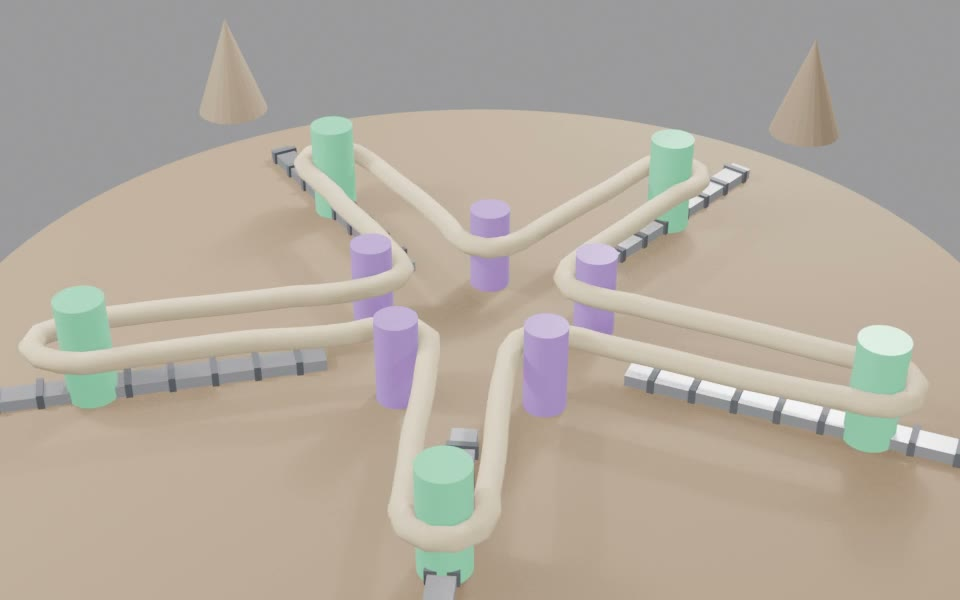

# Intermezzo 8A: Ye Tally Rope

> *If you had to explain money to your ancestors, you would not begin with coins. You would begin with all the trades that do not quite settle.*

**Part III — Trade, Coordination, Production** · [Index](README.md) · Prev: [Chapter 8](08-specialisation-gains.md) · Next: [Chapter 9](09-transaction-costs.md)

## Opening scaffold

The reader wakes up in a small village ten thousand years ago with one impossible job: explain money without coins, banks, states, prices, or economics. Start with four people, four goods, and one rope.

## Structural beats

1. Adam and Oz show the familiar comparative-advantage result.
2. Four villagers make the surplus obvious and the settlement problem unavoidable.
3. Fractional trades create leftovers that are real costs, not accounting trivia.
4. A public rope lets the village net obligations before they harden into personal debt.
5. The rope's value is not intrinsic. It is the value of the exchange it unlocks compared with the next best arrangement.
6. Cutting the rope into portable slices creates money, but also creates the cheating problem.
7. Several ropes by time horizon become the first visible credit market.

## Themes

- Money as transaction-cost infrastructure, not valuable stuff.
- Price as one public settlement ratio among many ways to judge value.
- Debt as one possible residue of unfinished exchange, not the essence of money.
- Supply certainty as a primitive design feature: everyone must know the length of the rope.
- Monetary demand as forward-looking: people want the instrument because it unlocks marginal future trades, not because value was pushed into it from the past.

## Draft

Suppose you find yourself living among your ancestors.

Not in a museum version of the past, with everyone helpfully arranged around a fire waiting for a lecture. You are simply there. The morning is cold. Someone wants a spear repaired. Someone else has smoked fish. A hide has to be scraped before it spoils. The tool you brought from the future is not a phone, or a spreadsheet, or a central bank. It is an idea you now have to explain with your hands.

You have to explain money.

This is harder than it sounds, because if you begin with coins you have already lost. Nobody here has coins. If you begin with banks, you sound mad. If you say "unit of account", the village quite reasonably continues sharpening things. If you say "medium of exchange, store of value, deferred payment", you are reciting a taxonomy that only makes sense after the fact.

So you begin where exchange begins: with a day that does not fit neatly inside itself.

Adam can make a spear in four hours and an axe in three. Oz can make a spear in one hour and an axe in two. Oz is better at both jobs. If this were a story about pride, Oz would make everything himself and Adam would sulk. But it is a story about time.

If each man makes one spear and one axe for himself, Adam spends seven hours and Oz spends three. The village gets two spears and two axes in ten hours.

Now let them specialise. Adam makes two axes. That takes him six hours. Oz makes two spears. That takes him two hours. They trade one for one. The village still has two spears and two axes, but now it took eight hours rather than ten.

Each has saved an hour.

This is the tidy version of the old Ricardo lesson. Even if Oz is better at everything, exchange can still raise living standards because people differ in relative advantage. Adam is less bad at axes than he is at spears. Oz is astonishingly good at spears. Specialisation does not require equality. It requires difference.

And the more they do it, the more difference there will be. Adam's hands learn axes. Oz's hands learn spears. The act of exchange creates the conditions for more exchange. Time saved becomes practice. Practice becomes competence. Competence becomes a reason to specialise further.

That is the beautiful part.

But if we stop there, we have told the nursery version of trade. It is true, but it hides the thing that makes the world difficult.

Adam and Oz can trade because there are only two of them, two goods, and a neat swap. The village is not like that.

Let us add Bea and Kai. The village now needs axes, spears, hides, and fish. Each person can make each thing, but not with the same ease.

| Person | Axe | Spear | Hide | Fish | One of each |
|---|---:|---:|---:|---:|---:|
| Adam | 3h | 4h | 8h | 6h | 21h |
| Oz | 2h | 1h | 5h | 4h | 12h |
| Bea | 5h | 6h | 2h | 4h | 17h |
| Kai | 6h | 5h | 4h | 1h | 16h |

If everyone makes one of everything alone, the village spends sixty-six hours.

If they specialise, Adam makes four axes in twelve hours. Oz makes four spears in four. Bea makes four hides in eight. Kai catches four fish in four. The same village bundle now costs twenty-eight hours.

Thirty-eight hours have appeared.

No new mine was discovered. No god handed down a machine. The gain is not hiding inside the axe or spear. It is in the pattern. The same people, with the same hands and the same daylight, have become richer because their work is arranged differently.

This is the first thing you want the village to feel in its bones: exchange is not decoration around production. Exchange changes what production can be.

But now the problem arrives.

Adam has made axes. Oz has made spears. Bea has hides. Kai has fish. The table says the village is richer, but the table does not move goods around. The table does not know who is hungry tonight. The table does not remember that Kai's mother helped Adam's child last winter. The table does not solve the awkward fact that one axe may be worth more than one fish but less than two hides, and the fish will rot before the argument ends.

So the village starts doing what humans do. They talk. They bargain. They remember. They promise. They forgive. They resent. They say, "I will get you next moon." They say, "Not after last time." They say, "That is not the same thing." They say, "Everyone knows an axe is not just a spear with a different handle."

All of this is economics. Almost none of it is price.

Now you take out the rope.

It is not a magic rope. It is not an anthropological origin story. We are not claiming that this is how money began, as if history were waiting to be replaced by a neat diagram. The rope is a teaching machine. It lets us make visible the part of exchange that usually disappears under words like "payment" and "market".

Even so, before the machine starts, an economist reading along raises her hand.

Before the rope goes anywhere near the pegs, she says, we should at least answer the obvious questions. Who comes up with this? What does it do that the existing settlement does not? Who pays to weave it?

Fair. The village did not wake up enlightened. It already has settlement. The chief speaks; the elder remembers; the cousins negotiate bridewealth; the feasts cancel obligations the words cannot reach; the blood debt closes what feast cannot. These are not nothing. They are how exchange has worked for generations, knitted into leadership, kinship, and the slow cooling of feuds.

So the rope is not appearing in a vacuum. It is competing with arrangements that already mostly work, for the people they were built to work for.

What does the rope do that the existing settlement does not?

It works at frequencies the chief cannot. Bridewealth resolves once. Feasts cycle slowly. A blood debt sits heavy and rare. None of these will help when Oz repairs Adam's spear on a Wednesday afternoon. The chief does not adjudicate one repaired spear. The cousins do not call a feast for half a hide. The rope handles the volume of small things — the trades too small for ritual and too frequent for memory.

It works across kin lines without converting strangers into kin. Kai and Adam are not cousins. Without the rope, every trade across the line either becomes a personal debt, which feels intrusive, or a gift, which feels expensive. The rope is the third option.

It survives a sick chief. The rope's memory sits in the rope, not in any one head.

Then the economist asks the harder question. Who weaves it?

The honest answer is that nobody sat down one morning to invent money. The rope-maker was already weaving. The village makes baskets, nets, snares, slings, carrying cords. The hands that do this work make rope continually as part of doing everything else. The first settlement rope is almost certainly a length set aside from a basket someone was making anyway — a piece of fibre that already existed for another reason, repurposed because someone said one evening, *let us keep track on this*.

That detail matters. The rope did not require a heroic founder. It required someone already weaving, someone with the time of an evening to set a length aside, and a village willing to try a ritual.

This is how every later money has actually appeared. Not from a council. From a side-effect of something already being done — a tax-collector's tally, a temple's grain record, a merchant's ledger, an exchange's order book, a programmer's hobby protocol. The infrastructure of money piggybacks on infrastructure built for other reasons. The rope-maker is the village's first platform: already weaving, lending the by-product, owed nothing in particular, and quietly carrying the bootstrap.

The economist nods. She has heard variations of this argument before, in larger rooms, about more expensive things.

With the economist temporarily satisfied, the machine can begin.

Tie the rope around four pegs. One peg for Adam, one for Oz, one for Bea, one for Kai. Let the rope lie in the middle where everyone can see it.

<figure class="sim-figure">
  <video controls loop muted playsinline width="640">
    <source src="figures/ye-tally-rope.mp4" type="video/mp4" />
    
  </video>
  <figcaption>The settlement rope: pegs around one surface the whole village can see, the marks its shared memory of unfinished trades.</figcaption>
</figure>

Then make a rule:

When a trade does not settle neatly, the village marks the rope.

If Adam gives Oz an axe now, and Oz does not yet give Adam something back, Adam receives marks on the rope and Oz gives up marks on the rope. If Bea gives Kai a hide, the rope remembers that too. The rope is not the good. It is not the value. It is the village's shared memory of unfinished exchange.

The first miracle is not that the rope pays anyone.

The first miracle is that the rope lets people stop carrying every unfinished trade inside a relationship.

Without the rope, Adam's axe to Oz is personal. Oz owes Adam. That may be fine once. It may even be warm and human. But multiply it across the village and the warmth becomes weight. Adam owes Bea. Bea owes Kai. Kai owes Oz. Oz owes Adam. Some of those debts are exact. Some are moral. Some are disputed. Some are too small to mention and too irritating to forget.

The village does not need a philosophy of debt. It needs fewer reasons to become angry.

So put numbers on the rope. Not because value is only number, but because settlement sometimes has to stop talking.

Let an axe be six rope marks, a spear four, a hide five, and a fish three.

Immediately you can see the next problem. These are not clean swaps. One axe is one and a half spears. One hide is one and two-thirds fish. Two fish are one axe, but one fish is half an axe, and nobody wants half an axe unless the argument has gone very badly.

Fractional prices are not a modern nuisance. They are one of the reasons money is useful. Trade creates leftovers. Leftovers create memory burdens. Memory burdens create quarrels, favours, delays, and avoidance.

The rope absorbs the leftover.

Now run one market day through it.

| Trade | Rope movement |
|---|---:|
| Adam gives Oz an axe | Adam +6, Oz -6 |
| Oz gives Bea a spear | Oz +4, Bea -4 |
| Bea gives Kai a hide | Bea +5, Kai -5 |
| Kai gives Adam fish | Kai +3, Adam -3 |

If you wrote these as separate IOUs, the village would have eighteen marks of gross promises running around. Adam would remember Oz. Oz would remember Bea. Bea would remember Kai. Kai would remember Adam. The circle looks friendly from above and annoying from inside.

But the rope nets them.

| Person | Gave | Received | Net |
|---|---:|---:|---:|
| Adam | 6 | 3 | +3 |
| Oz | 4 | 6 | -2 |
| Bea | 5 | 4 | +1 |
| Kai | 3 | 5 | -2 |

After four trades, only four marks need attention: Adam is up three, Bea is up one, Oz is down two, Kai is down two.

That is already a change in the social weather. The village has not eliminated obligation, but it has compressed it. Four relationships do not each have to remember their own little history. The rope has converted a pile of bilateral stories into a smaller public balance.

Then the day continues.

Oz repairs Adam's spear for two marks. Kai gives Adam an extra fish for one. Kai gives Bea an extra fish share for one. Now the net clears.

| Person | Earlier net | Later trades | Final net |
|---|---:|---:|---:|
| Adam | +3 | -3 | 0 |
| Oz | -2 | +2 | 0 |
| Bea | +1 | -1 | 0 |
| Kai | -2 | +2 | 0 |

Twenty-two marks of exchange have happened. Final settlement is zero.

This is the part to sit with. The rope did not create goods. It did not make Adam faster or Kai luckier. It did not command anyone to trade. What it did was let trade happen without requiring every trade to end in an immediate reciprocal match.

It destroyed debt before debt hardened.

That is not because money is "really debt". It is almost the opposite. Money, in this thin form, is a device for preventing every unfinished exchange from becoming a personal debt. It lets the village say: this is not you owing me in the thick sense; this is the public residue of a trade that the system can clear later.

Once you see that, the old arguments about whether money is a commodity or a debt start to look mis-aimed. The rope is not valuable because the fibre is precious. It is not valuable because Oz has promised to redeem it in silver. It is valuable because everyone can see the same settlement surface and because that surface lowers the cost of exchange.

The value of the rope is the value of the trades it unlocks compared with the next best thing.

Imagine the village has three possible arrangements.

| Arrangement | What happens | Cost |
|---|---|---:|
| No shared record | People trade only when swaps are clean or trust is personal | 66h bundle cost |
| Private IOUs | More trade happens, but memory, dispute, and enforcement are expensive | 48h effective cost |
| Public rope | Trade nets across the village before most debts become personal | 32h effective cost |

Do not worship the numbers. They are there to make the shape visible. The rope is worth sixteen hours against private IOUs and thirty-four hours against isolated household production.

But even that sentence is a little dangerous, because it can make value sound backward-looking. As if the rope must be backed by yesterday's surplus, yesterday's labour, yesterday's sacrifice, yesterday's commodity, yesterday's state decree, and then by something behind that, and something behind that, turtles all the way down.

That is the wrong direction.

People do not demand the rope because value was pushed into it from history. They demand it because accepting it opens a better next move than refusing it. It lets the next awkward trade happen. It turns the next fractional leftover into a public balance rather than a private quarrel. It lowers the transaction cost of the next marginal exchange.

Monetary value is pulled from the subjective future, not pushed from the objective past. Intrinsic stuff does not enter the equation.

History still matters. Yesterday's successful rope trade makes tomorrow's rope trade more credible. Repetition builds common knowledge. Common knowledge makes acceptance rational. But the operative demand is forward-looking. A rope mark is useful because of what it lets the holder do next.

So if someone asks what backs the rope, the clean answer is: nothing in the old sense. It is not backed by fibre, labour, metal, or myth. It is demanded because it unlocks trades at the margin by lowering total transaction costs.

This also gives us a cleaner distinction between value and price.

The axe has value because it helps someone chop, build, defend, or repair. The price of the axe is the public settlement ratio the village is willing to use today: six rope marks. The two can move together, but they are not the same object. A hungry person may value fish more than the rope price says. A ceremonial axe may carry meaning no price can settle. A winter shortage may make the same hide feel different from the summer hide.

Price is what lets the rope close. Value is what made anyone care enough to trade in the first place.

This is why the rope is useful without pretending to be metaphysics. It does not tell the village what everything truly means. It gives the village one channel for settlement among many channels of human judgement. There will still be gifts. There will still be obligations. There will still be care, apology, insult, bridewealth, punishment, tax, feast, mourning, and status. The rope does not replace the modes. It handles the part of exchange that benefits from being made thin. Which is to say: the village has not adopted a new philosophy. It has chosen, trade by trade, which discipline of clearing each exchange belongs to — and built one channel, the clear-it-now channel, so that the small trades of neighbours and strangers no longer have to be carried by kinship, rank, or love.

Thinness is a great achievement.

It is also where the danger begins.

As long as the rope sits in the middle of the village, everyone can inspect it. The supply is symmetrically known. Every so often, perhaps after the moon changes, the village lays out the whole rope and checks its length together. No mystery. No priestly accounting. No hidden drawer. If the rope has one hundred marks of settlement capacity, then everyone knows there are one hundred marks. That knowledge is not decorative. It is part of the mechanism.

Known supply makes the rope speak in public.

But the central rope has limits. It does not travel well. If Adam walks to another village, he cannot drag the whole settlement system behind him. If the village grows from four people to twenty, then eighty, then two hundred, the public rope becomes harder to inspect and slower to use. The very thing that makes it trustworthy makes it clumsy.

So someone has the obvious thought.

Cut the rope.

Give people little pieces of it. A slice of rope can travel. A slice of rope can settle away from the pegs. Adam can take it to the next valley. Bea can keep it until winter. Kai can hand it to someone who never met Oz.

This is the quickest route from ledger to money.

It is also the quickest route from shared memory to cheating.

When the rope is whole, the village can know its length. When the rope is cut into pieces, someone can cut extra pieces. Someone can shave a little fibre. Someone can make a convincing imitation. Someone can bring in a rope from elsewhere and claim it belongs to the same circle.

The portable version lowers one cost and raises another.

That is monetary design in miniature. A central ledger is legible but local. A portable token travels but must be protected against forgery, over-issue, and confusion. A commodity token solves some cheating problems but imports the problem of intrinsic scarcity. A state token solves some acceptance problems but imports political power. A cryptographic token brings back the public rope without the village, making supply and transfer visible to strangers, but it cannot bring back the village's social context. Each design moves the burden. None abolishes it.

The rope also lets us see why "money as debt" can mislead.

Of course the rope records unfinished exchange. Of course a negative position feels debt-like. Of course many historical monies are entangled with taxes, tribute, courts, and enforceable obligations. But in the village rope, the point is not to make every trade a debt. The point is to prevent every trade from requiring a personal debt.

Debt is what happens when settlement cannot be made thin enough, public enough, or timely enough.

Money is one way to keep the residue mobile until it clears.

Now add time.

One rope is not enough for a real village. Some promises are for now. Some are for next moon. Some are for after harvest. Some are indefinite because life is indefinite. So the village hangs four ropes.

Now.

Next Moon.

Next Year.

Whenever.

This is already a credit market, before anyone has said "interest rate". A mark on the Now rope is not the same as a mark on the Next Year rope. The time horizon matters. The risk matters. The relationship matters. The reason matters. A person who is short on the Now rope but rich in expected harvest may be trusted differently from someone who is short everywhere. A family may be extended more time after illness than after gambling. A hunter's promise after winter is not the same as a fisher's promise after the thaw.

Once more, price is only one channel.

The village may also add a pot rope. Marks paid into the pot are not owed to one person. They maintain the fire pit, repair the path, feed guests, care for widows, prepare a feast, or make war. The pot rope is where exchange stops looking private and starts looking obligated. It is where contribution becomes membership.

Before the little machine becomes a theory, the village has to survive the weather.

The rope so far has been tested by abundance, civility, and reasonable behaviour. A real rope is judged by storms.

The first storm is death. Oz dies owing four marks. The marks do not vanish because Oz is gone. The village must decide: do his children inherit the position, does the chief absorb it, does the rope quietly forget? Each rule is a different theory of what a mark is — private debt, public balance, or social courtesy. The village's answer, made once and barely noticed, will define the rope for generations.

The second storm is drought. The hides do not stretch; the fish do not run; the pot rope is empty because no surplus has gone in. The marks are still there. The village discovers, often the hard way, that the rope mediates trade but does not produce. A society that confuses the two will eventually misread famine as a money problem.

The third storm is cheating. Someone shaves a mark. Someone denies one. Someone claims a credit the rope does not show. The rope's only defence is the ritual of laying it out in full at agreed intervals and counting in public. The defence is not mechanical; it is social. Without the ritual, the rope rots invisibly. With it, cheating cannot survive a moon.

The fourth storm is the outsider. A trader from another valley arrives with shells and asks: what is this rope? If the village hands him a mark in return for goods, the rope has just left the village. It now travels in heads that cannot inspect it. That first cross-village mark is a quiet revolution. It is the moment the rope becomes portable on credibility rather than presence.

The fifth storm is issuance. The village wants more trade and so needs more marks. Someone has to lay more rope. Who decides? In a small village the answer is *everyone, in public, when the rope is laid out*. The ritual of inspecting the rope in full at each moon, almost invisible on a quiet day, is in fact the village's monetary policy committee. That is its enormous virtue. Everyone present. Nothing hidden. Issue too much and the next inspection will notice. Issue too little and trades will visibly fail to clear. The feedback is in the room.

The list does not end at five. Hoarding will arrive — one careful hand removing marks from circulation until trades cannot clear, because the marks needed to clear them are sitting in a basket. Factions will arrive — two parts of the village disagreeing about whose net is whose, where the numbers on the rope do not include why. Both are real storms. Both will eventually need answers. But they are the same lesson the first five teach, made larger: the rope records, but it does not adjudicate, produce, or decide.

A rope that survives these storms is not a clever rope. It is a clever rope inside a competent village. The two cannot be separated. Money does not float free of the rest of social life. It rests on it.

At this point, the little machine has become a theory.

Exchange has modes before it has markets. Some transfers belong to price. Some belong to care. Some belong to status. Some belong to duty. Money does not erase those modes. It bundles them, masks them, moves between them, and sometimes makes us forget they were different.

The rope is useful precisely because it is thin. It reduces the wrong memory burden. People no longer have to remember every fractional leftover from every exchange. They no longer need a perfect coincidence of wants. They no longer need to turn every small mismatch into a favour or grievance.

But if the rope becomes too successful, another forgetting begins.

The village may start to think the rope is the economy. It may start to think the mark is the value. It may start to think the person who cannot keep up with the marks has failed, rather than asking which mode the exchange belonged to, which burden the system placed on them, or who benefits from making the rope feel natural.

That is the later story. It is the story of stable money, price memory, subscriptions, financial literacy, household instrumentation, and the strange modern demand that buyers navigate an instrumented economy by intuition.

For now, stay in the village.

The sun is going down. The fish has been eaten. The hide has been stretched. The spear is repaired. The axe is beside the door. Nobody has paid with gold. Nobody has invoked a central bank. Nobody has discovered the essence of money.

They have done something more modest and more profound.

They found a way to let useful trades happen without making each trade carry the full weight of relationship, memory, timing, and trust.

Once in a while, they lay out the rope together and check its length.

That is not superstition. It is monetary governance in its smallest visible form.

The village is asking the only question money ever really has to answer:

Can we all see enough of the same system to keep trading tomorrow?
