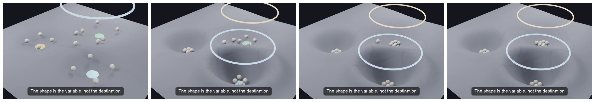

# Epilogue: The Machinery

> *The body of this book carried no equations and no code, on purpose — the rope, Doña Elena, and the Big Mac did the work. This epilogue is for the reader who wants to see the mathematical machinery underneath. The appendix that follows makes the framework executable. Neither is required to understand the book. They are here to show that the prose was load-bearing, not hand-waving — that "floorless but fruitful" is an inequality, that "nothing needs to back it" is a result with existence proofs, and that "money is a ledger" can be stated as operations precise enough to run.*

**Part VIII — The Machinery** · [Index](README.md) · Prev: [Chapter 23](23-defensive-vocabulary.md) · Next: [Appendix](appendix-executable-canon.md)

The framework lives in three registers. The body of the book is the **seeing** — the way of looking the questions install. This epilogue supplies the **mathematics**: the claims made formal enough to be wrong. The appendix supplies the **contracts**: the claims made concrete enough to run. They are one object viewed three ways.

---

## Part A — The Mathematics

A reader's guide, not a textbook: each result is stated and sourced to the literature it comes from. This is the map, not the full territory — the derivations are sketched, not completed here. The empirical figures cited in the body (Smith's pins, the Korea ratio, the transaction sector, M-Pesa) are drawn from the literature and still want a fact-check pass before anyone calls them final.

### A.1 Why money emerges — the abiogenesis inequality

Give each good *i* a **tradeability** `τᵢ ∈ (0,1]` — the ease of one trade-leg involving it. Direct barter X→Y needs a *double* coincidence; with `d ≪ 1` the double-coincidence factor,

```
C_direct  = κ / (τ_X · τ_Y · d)
```

Mixing in an intermediary M (X→M→Y) is two *single*-coincidence legs,

```
C_indirect = κ/(τ_X·τ_M) + κ/(τ_M·τ_Y)
```

Indirect beats direct iff, after cancellation,

```
        τ_M  >  d · (τ_X + τ_Y)
```

Because `d` is tiny (direct barter is wildly improbable), the bar on the right is near zero: **even a modestly-tradeable intermediary beats barter, despite adding a trade.** That is the whole of "money's value is the transaction cost it avoids," in one line.

### A.2 Why money self-assembles — autocatalysis

Make tradeability endogenous: `τ_M = β_M · g(a_M)`, where `a_M` is the fraction who accept M and `g` is increasing (more acceptors → easier to offload). Then *use M → a_M↑ → τ_M↑ → M wins more pairs → more use.* A good whose use-as-money raises its own tradeability is the economic analogue of an autocatalytic set: the smallest edge `β` snowballs to monopoly, converging on **one** good with `τ→1`. Money is not designed; it precipitates from the gradient. (Kiyotaki–Wright 1989, in transaction-cost dress; instantiated as the *Kiyotaki-Wright* contract of Part B.)

### A.3 Why the *ledger* wins — the decomposition

Decompose the per-leg cost and ask which good-properties cut each piece:

| cost component | what cuts it | ledger or commodity? |
|---|---|---|
| search (find a counterparty) | acceptance / network | ledger-network (the feedback) |
| bargaining / sizing | divisibility + fungibility | **ledger** |
| verification (cheated on quantity?) | known, symmetric supply | **ledger** |
| carriage (hold between legs) | weightless transfer | **ledger** |
| ~~use-value, "intrinsic worth"~~ | — | **commodity — cuts nothing** |

Every component that lowers transaction cost is a *ledger* property; the commodity properties are orthogonal. So `β` is high to the extent a good is *ledger-like*, and the autocatalytic climb does not stop at a commodity — it runs to the `τ→1` limit, the **pure ledger**. (The formal spine of Chapters 4 and 8A. The two-village identity `φ(h)ᵢ = (L/N)·hᵢ` — slices-of-rope versus length-of-rope — says the same thing in symbols.)

### A.4 The value of money — floorless but fruitful

Money's worth is not a stock behind the token; it is the flow of trades the token unlocks. Formally, value money by the **marginal utility of holding real balances** (Patinkin) — the liquidity service — and *derive* that service from explicit frictions: no double coincidence, no commitment, no memory (Lagos–Wright). The worth is the surplus of trades that occur only because the medium is accepted, priced at the carry-cost margin. It is **floorless** (no prior substance enters the valuation) and **fruitful** (the surplus is real), **pulled** from the expected future rather than pushed from the past. Two preconditions gate it and fail separately: **acceptance** (selection) and **availability** (a market).

"Pulled from the future" is not a metaphor; it is the direction of the valuation equation. In Lagos–Wright dress, the value of a unit of money today is

```
φ_t = β · E[ φ_{t+1} · (1 + L(q_{t+1})) ]
```

— discounted expected value *tomorrow*, times one plus the liquidity premium `L` (the marginal surplus of the trades the balance lets you close). Iterate forward and, under the no-bubble condition `lim β^T φ_{t+T} → 0`,

```
φ_t = Σ_{s>t} β^(s−t) · E[ liquidity service at s ]
```

— the value of money is the discounted stream of its **future** liquidity services, full stop. The recursion contains no backward-looking term: Mises's regression runs `t → t−1`; the modern valuation equation runs `t → t+1`. The past appears nowhere in the formula — it enters only as *evidence* agents use to form the expectations inside `E[·]`, which is exactly the body's claim: history matters as evidence for acceptance, never as a source of worth.

### A.5 The prize — specialisation × network

Specialisation gains are Smith's (the pin factory: ~1 → ~4,800 pins per worker), bounded by *the extent of the market.* A money network's value to a user scales with the others reachable — Metcalfe, `V ∝ N²/2` — which, run in reverse, is the **cold-start**: the first users get ≈0, so adoption needs a non-utility engine. The body's order-of-magnitude claim — ~2 orders of magnitude between non-monetary and good-monetary coordination — is an *estimate* triangulated from density–monetisation correlations and natural experiments (the Korean divergence), not a measured constant.

### A.6 The real economy — transaction costs

Coase (1937): firms exist to internalise transaction costs. Wallis–North: the measured *transaction sector* of a developed economy is on the order of half of GDP. So supply/demand/price are *downstream* of transaction-cost structure, and lowering that cost (M-Pesa, ≈2% of Kenyan GDP) is the master lever.

### A.7 The substrate — the axioms

A money substrate needs two families (Chapter 4 / Stone 4): **resolution** (sufficient divisibility) and **integrity** (no phantom value — conservation + authentication + symmetrically-known supply). The three integrity requirements are *independent* (drop any one and a distinct attack gets through). The pin: **known ≠ fixed** — integrity asks the total be *auditable*, not *frozen*; scarcity is a rigid over-satisfaction. And the **skims live in the sufficiency-gaps**: the shortfall between *sufficiently*-known and *perfectly*-known supply is exactly where the Cantillon redistribution operates. (Gap-closing cuts the per-unit *rate*; more usage grows the *base* — so de-extraction is a rate-margin effect, not unconditional.) Necessity ✓, independence ✓, sufficiency argued, not proven.

### A.8 The trajectory — the comparative law

The one falsifiable claim about where money *goes*: it regresses toward the minimal ledger **where the extraction surface is contestable** (measured ex-ante: exit, transparency, competition) and **persists where captured** — conditional β-convergence (Barro–Sala-i-Martin) applied to the ledger. The mechanism is the **efficiency↔extraction coupling**: the properties that make money efficient are tied to its extractability (the seigniorage / financial-repression literature), our packaging being that extraction lodges in the axiom sufficiency-gaps. This is *descriptive of the design space*, not a forecast — the three engineered attractors (relational-minimal, hard-money, authoritarian-control) are a **map, not a prophecy.**

<figure class="sim-figure">
  <video controls loop muted playsinline width="640">
    <source src="figures/design-space-landscape.mp4" type="video/mp4" />
    
  </video>
  <figcaption>The design space as a landscape. Change the pulls and the wells move; each system settles into whichever basin the conditions carve. The shape is the variable, not the destination — a map, not a prophecy.</figcaption>
</figure>

### A.9 The modes — four clearing disciplines of one ledger

The joint between the book's two halves, made explicit. Fiske's four relational models map, in Fiske's own presentation (1991; 1992, *Psychological Review*), onto the four classic measurement-scale types: Communal Sharing = **nominal**, Authority Ranking = **ordinal**, Equality Matching = **interval**, Market Pricing = **ratio**. Read against A.3, this makes the modes the four **resolutions a ledger can keep** — equivalently, four **clearing disciplines**:

| mode | scale (Fiske) | clearing rule |
|---|---|---|
| Immediate | nominal | never clears — entries recorded, never nettable |
| Obligated | ordinal | clears on schedule, with penalty |
| Balanced | interval | nets over a window toward zero drift |
| Value | ratio | clears instantly at ratio prices |

Money (Chs 4–8A) is the **V-discipline given infrastructure** — the `τ→1` ledger of A.3 running the instant-clearing rule between strangers. The bootstrap engines (Ch 6) are mode-subsidies: three of the four are another discipline's demand paying for the V rail. Collapse (Ch 19) is fallback down the discipline stack plus the re-weaving of minimal ledgers. The Tally (Ch 22; the *Fiske* and *Zelizer* contracts) is the four-discipline ledger restored.

**Status, exactly:** the scale mapping is Fiske's; the clearing packaging is ours; nothing here is a theorem. It is the frame that makes the book's two halves one object — drop it and every result in A.1–A.8 stands unchanged.

### A.10 The no-floor result — intrinsic value is neither necessary nor sufficient

The body asserted that money never needed to be *worth something* underneath. Here is that claim in its strongest available form: not a slogan but a two-sided demolition, with the best objection met on its own terms.

**Not necessary (existence proofs, theory).** Exhibit economies where an object with *zero* consumption value is valued and does all monetary work. Samuelson (1958): in an overlapping-generations economy, an intrinsically worthless token sustains a positive-value equilibrium and *improves welfare* — money as "social contrivance," valued because the next generation will value it. Kiyotaki–Wright (1989): a fiat object with no consumption value and no storage advantage circulates in equilibrium once beliefs coordinate on it. Lagos–Wright (2005): the same, microfounded, with the frictions stated exactly — no double coincidence, anonymity, no commitment, no record-keeping. And the capstone, Kocherlakota (1998): the token is *dispensable entirely* — a costless public record implements every allocation money implements, and vice versa. If the job can be done by an object with no value, and even by no object at all, then value-in-the-object was never the operative ingredient. Record-keeping was.

**Not necessary (existence proofs, practice).** Every major currency since 1971 — half a century of irredeemable fiat, functioning. Bitcoin — no prior commodity use worth naming, bootstrapped on expectation alone. Mutual-credit systems — WIR since 1934, LETS, the ledger of Part B — where there is literally *no token*, only signed balances summing to zero. The village rope, whose fibre is worth nothing and whose marks clear a day's trade.

**Not sufficient (the counterexamples).** Run the A.3 decomposition again: intrinsic worth cuts *no component* of transaction cost — not search, not sizing, not verification, not carriage. And the world agrees: diamonds are supremely valuable and have never been money; gold in a vault with no acceptance network carries no monetary premium at all; a hyperinflated note retains exactly its paper value — the "intrinsic" part — which is to say, nothing. Valuable things do not become money by being valuable.

**What intrinsic value actually did.** For any commodity money, decompose the price: *use value + monetary premium*. The premium is A.4's liquidity service; the use value is the bootstrap engine of Chapter 6 — a solution to the cold-start (ignition, selection), never a source of the worth (A.4). Gold's ornament demand solved *which object* and *how it started*; the trades solved *what it was worth*. The history of money is the premium migrating to ever-thinner substrates (A.3); at the `τ→1` limit the use value is zero and the premium is everything — the limit we live in.

**The regression theorem, met at its strongest.** Mises (1912) is the one serious argument that intrinsic value is *logically* necessary: money's utility is only its exchange value, so grounding it in exchange value is circular; the regress must terminate in a prior *commodity* use. Keep his kernel — today's expectation needs yesterday's evidence; marginal utility against known supply is the right value theory. Refuse his terminus, using his own concession: Mises lets the diamond's value halt at a *directly-valued use* — he never demands a commodity beneath the ornament. But the ledger supplies exactly such a use from day one, carried on a worthless substance: the better-than-memory, conflict-settling service, which a group pays for in real goods as it pays an arbitrator or a measurer — a genuine prior, non-monetary price, terminating cleanly. The rope is the controlled experiment: gold carried ornament-value and ledger-service confounded, and Mises attributed the anchor to the substance; the rope zeroes the substance, and money emerges anyway. Strip the confound and the value does not vanish — so the substance was never holding it up. **Honesty about strength:** this defeats the letter of 1912 and shifts the burden — Mises must now say why the terminating use must be *material*, and his own diamond denies him the answer — but it is a burden-shift, not a checkmate; a determined Misesian can still dig in on the service-price. The commodity, either way, is retired.

**Status:** every proposition above is borrowed — Samuelson, Kiyotaki–Wright, Lagos–Wright, Kocherlakota — except the closing move, which is only the framework reading Mises against Mises. The assembly is the contribution. "Disproof" here means what it can honestly mean: necessity refuted by existence proof, sufficiency refuted by counterexample, and the strongest surviving objection conceded its kernel, met on its own terms, and reduced to an unsupported burden.

---

## Part B — From proof to construction

The mathematics can show that intrinsic backing is unnecessary, that acceptance and availability are separate gates, and that the value recursion points forward. It cannot tell us who may debit whom, who controls a credit limit, how an index enters a wage, or what happens when an assertion is challenged. For that, the nouns must become verbs.

The appendix that follows is the full executable canon: eleven implemented Solidity contracts, the Gesell overlay inside the memory ledger, the seven modules exercised by the current end-to-end file, the four implemented modules not yet integrated there, and the named rooms still waiting to be built. It is an educational demonstrator, not a currency or an audit.

Its centre remains two paired writes: one balance down, one balance up, net zero. Around that centre the code separates what ordinary money bundles—settlement, unit, deferred obligation, productive credit, price discovery, governance, enforcement, relational permission, emergence, and stabilisation. Every dossier states not only what the mechanism claims, but what the present code actually executes and where the aspiration still outruns the implementation.

That last distinction is the reason for giving the contracts their own appendix. A seven-page catalogue made the building look finished and the hard parts look like footnotes. They are neither. Identity, privacy, Sybil resistance, oracle truth, governance legitimacy, legal enforcement, adoption, and agent ownership are the building's open walls. The code is useful because it lets us point to them.

---

## Part C — Where the machine hands back

The most dangerous question this book can be asked arrives at about this point, and it is usually asked kindly: *so your system is trustless too?*

It is dangerous because the honest answer is no, and because every project that has answered yes has been wrong in the same way. Trust was not abolished. It was relocated to somewhere less visible and then described as absent — which is the oldest move in this book, performed by people who believed they were its opposite.

So the answer is no, and the claim is smaller and more useful. What the machinery buys is not the removal of human judgement but its **enumeration**. Every point where the code stops and a person decides can be named, counted, and guarded. A mechanism whose judgement points are listed is a different object from one whose judgement points have been dispersed into the phrase *the system* — not because the first has fewer of them, but because you can argue about a list.

And the list has a structure, because judgement is not one substance. The guard that fits one kind is a category error applied to another. There are four.

**Adjudicative** — *this claim is disputed; who decides?* It needs an arbiter, an appeals path, a verifier who is not a party to the outcome. The wrong guard is a majority with a stake in the answer.

**Epistemic** — *what is the state of the world?* It needs a measurement body with a published, re-derivable method. The wrong guard is a vote. You cannot ballot a fact, and a mechanism that puts the inflation reading to a poll of the people it will pay out to has not decentralised a measurement; it has auctioned one.

**Normative** — *who bears this, and who gets that?* It needs the affected parties, voting, with real exit. Here the wrong guard is the expert — a technocrat with an objective-looking formula, settling a question that was never technical. This is Chapter 17 in miniature, and the machinery reproduces the error as readily as a parliament does.

**Constitutive** — *who counts as a member at all?* It is prior to the other three, because each of them presumes an answer to it. We do not have one. Every working system borrows it from whoever issues real-world credentials, which is to say from a state or a platform. It is an open wall, and naming it is the most we can currently do.

Two of those take a vote. Two are ruined by one. When we audited our own machinery against this list we found it routing almost everything to a ballot — the reflex of a design culture that has learned to read *voting* as *legitimacy* — and the finding was not that the votes were rigged but that half of them were being asked questions a vote cannot answer.

Then the reading that turns the list from an accounting exercise into something worth publishing. **A register of judgement points is a register of capture points.** They are the same list read with a different intention. Anyone wishing to bend the mechanism does not attack the arithmetic, which is the part that cannot be bent; they attack the arbiter, the measurement, the membership roll. So the register is simultaneously the honest disclosure and the attack surface — and publishing it is still right, because the alternative is a system whose capture points are known only to whoever finds them first.

**And nothing in it can act.** Every clearing in the machinery waits for someone to call it. The code can enforce *whether* a clearing is valid; it can never bring about *that one happens*. Which means the clearing-discipline claim — the spine running from the rope through the modes to the Tally — is only half executable. The half that says *this settlement is well-formed* is machinery. The half that says *settle now* is a person, standing outside the mechanism, unnamed anywhere in it and load-bearing everywhere. We would rather state that than let a reader discover it.

Last, and least visible: **the record's resolution is an authoring decision.** What a mechanism makes inspectable is not a property of the ledger it runs on; it is what its builders chose to write down. Anything that happens without being recorded leaves no trace to audit, and the granularity of that recording is set quietly, by us, in advance, for a reader who was not consulted. For a framework whose whole demand is that extraction be made visible, this is the master judgement point — because a machine that concealed its own choices about visibility would be running the book's central trick one level down, in better clothes.

**And there is a second register, which this one implies and does not contain.** Everything above enumerates where the *code* hands back to a **person**. It says nothing about where a *model* hands back to an **assumption** — and those are different lists. That a population's preferences are stable, that a mechanism reaches the equilibrium ascribed to it, that agents know what the model says they know: none of these is a judgement anybody makes. They are places a theory quietly stops being mechanical, and standard notation is not obliged to mention them.

They could be held the same way, and this is the one proposal in this book that runs ahead of what is built. Not by computing them — nothing computes whether preferences are stable. By **contracting** them: each assumption stated with a scope, a stake, and a named observation that would refute it; each result declaring which assumptions it rests on; and refutation *propagating*, so that killing an assumption marks everything downstream unsupported without anyone having to decide it should. The primitive for that is the enforcement bond already in the canon. What is missing is the graph.

Follow it far enough and it stops being a register and becomes a notation — one specification of an economic claim that can be proved, simulated with heterogeneous agents, and deployed to people, with the disagreements between those three treated as findings rather than errors. Modes would be **types** in it: A.9's table is a typing rule, and averaging entries that never clear is a category error a compiler could catch, which is more than prose has ever managed. That is a programme, not a result, and it is written up separately. Two things stay irreducible inside it, and they are the two this section already named — who may enter a claim at all, and the fact that nothing moves until somebody calls it.

That is why this section is in the book rather than in the code's own documentation. The framework asks who holds the pen. It would be a poor thing if it declined to answer the question about itself.

---

## Coda

Three registers, one object. The body is the **seeing** — what you carry out the door. The mathematics asks whether the seeing is *consistent* — whether the claims survive being made formal. The contracts ask whether it is *operational* — whether every trusted noun can be turned into a visible act. And the register of judgement asks the question the other two cannot: where the operational thing *stops*, and who is standing there when it does. You need only the first. The others are here so that, if you ever doubt the prose was honest, you can check — including against the places it admits it runs out.
